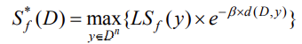
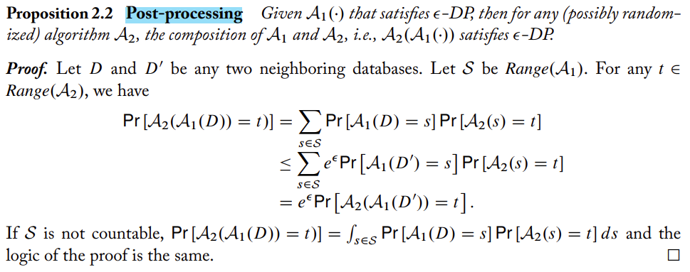

## 差分隐私定义：
假设一个随机函数 M , 使得 M 在任意两个相邻的数据集 D 和 D’(即`||D -D'||_1 <= 1`)上得到任意相同输出集合 S 的概率满足：  
`Pr[M(D) ∈ S] ⩽ exp(ε) * Pr[M(D′) ∈ S] + δ` 则称该随机函数 M 满足`(ε,δ)-differential privacy`，简写为`(ε,δ)-DP` 
这种形式的差分隐私是宽松的. 当 δ=0 时，称为 `ε-DP`也就是纯差分隐私定义. 其中 ε 称为隐私预算.

## 部分内容说明
- 隐私损失  
差分隐私（DP）的定义实际上是保证去掉/改变一个样本不会对 M 的输出造成显著的影响。换言之，DP保证了 `M(D)` 和 `M(D')` 有着相似的概率分布。
按照DP的定义，如果 `M(D)` 和 `M(D')` 的概率分布相差越大，那么隐私损失就越大；如果 `M(D)` 和 `M(D')` 的概率分布相差越小，那么隐私损失就越小。

- 邻近数据集：只相差一条记录的一对数据集. 即 ||D - D′||_1 <= 1. 

- 查询函数: f: X -> R， 主要作用是将数据集 X 映射成为 R

- 全局敏感度 ：`GS_f(D) = Δf = max(D,D′) ∥f(D)−f(D′)∥1`.  `∥f(D)−f(D′)∥1` 是 f(D) 与 f(D‘) 之间的曼哈顿距离
全局敏感度反映了一个查询函数在一对相邻数据集上进行查询时变化的最大范围。它与数据集无关, 只由查询函数本身决定

- 局部敏感度 ：`LS_f(D) = Δf = max(D′) ∥f(D)−f(D′)∥1`.  `∥f(D)−f(D′)∥1` 是 f(D) 与 f(D‘) 之间的曼哈顿距离  
与全局敏感度不同, 局部敏感度是由查询函数和给定的数据集共同决定, 因为局部敏感度只是对于一个数据集做变化。   
局部敏感度和全局敏感度的关系可以表示为：`S(f) = max(D) {LS_f(D)}`
容易看出，局部敏感度会与数据分布有很强的关联，但全局敏感度一般较大. 故在需要使用局部敏感度时，常采用局部敏感度的平滑上界.

- 平滑上界  
给定一个 β > 0 , 对于一个函数 F:D --> R , 在查询函数 f 上, 如果它满足如下条件  
`∀D：F(D) >= LS_f(D) ， ∀D,D’：F(D) <= exp(β) * LS_f(D’)` 则称函数 F 是一个在查询函数 f 上的 `β-平滑上界`

7. 平滑敏感度
对于一个  β > 0 , 一个查询函数 f 的 β-平滑敏感度为：  

## 差分隐私性质
- 后传性  
假设给定一个随机函数A1，且满足`ε-DP`,对于任何随机算法A2，那么A1和A2的组合也是满足`ε-DP`，例如：`A2(A1(x))`

- 平行组合   
假设我们有一组隐私机制 `M = { M1， … ， Mm }` 如果每个 Mi 对整个数据集的互不相交子集提供 `ϵ-DP` 保证，则 M 将提供 `max {ϵ1，…，ϵm}-DP`  
这个性质说明了, 当有多个算法序列分别作用在一个数据集上多个不同子集上时, 最终的差分隐私预算等价于算法序列中所有算法预算的最大值

- 顺序组合   
假设在数据集上依次执行一组隐私机制 `M = { M1 ， . . . ， Mm }`，并且每个 Mi 提供 `ϵ-DP` 保证，则 M 将提供 `(m * ϵ)-DP`  
这个性质说明了, 当有一个算法序列同时作用在一个数据集上时, 最终的差分隐私预算等价于算 法序列中所有算法的预算的和

- 高级组合
1. 定理：对于所有`ε, δ, δ′ ≥ 0`，`(ε,δ)-差分隐私`机制类满足 k 倍自适应合成下的 `(ε′, kδ + δ′)-差分隐私`，其中：
`ε′ = sqrt(2kln(1/δ′)) * ε + kε(e^ε − 1)`  
2. 推论：给定目标隐私参数 `0 < ε' < 1, δ' > 0`,为确保在 k 个机制上的累积隐私损失是`(ε′, kδ + δ′)`，只要每个机制是`(ε,δ)-差分隐私`即可，其中：
`ε = ε' / (2 * sqrt(2kln(1/δ′)))`  
3. 证明，当 `ε′<1` 时，我们期望 `ε* ≤ ε′`。由第一段定理可知对于所有 δ′ 合成的隐私损失为 `(ε*, kδ+δ′)` ，  
其中 `ε* = sqrt(2kln(1/δ'))ε+ kε^2`  

- 变换不变性  
给定任意一个算法 M1 满足 `ε-DP`, 对于任意算法 M2 ( M2 不一定是满足差分隐私的算法), 则有 M(•) = M2(M1(•) 满足  `ε-DP`  
这个性质说明了差分隐私对于后处理算法具有免疫性, 如果一个算法的结果满足 `ε-DP`, 那么在这个结果上进行的任何处理都不会对隐私保护有所影响。

- 中凸性  
给定 2 个算法 M1 和 M2 满足 `ε-DP`。对于任意的概率 p∈[0,1], 用符号 Mp 表示为一种机制, 它以 p 的概率使用 M1 算法, 以 1-p 的概率使  
用 M2 算法, 则 Mp 机制满足 `ε-DP`  
这个性质说明, 如果有 2 个不同的差分隐私算法, 都提供了足够的不确定性来保护隐私, 那么可以通过选择任意的算法来应用到数据上实现对数据的隐私保护，只要选择的算法和数据是独立的。

## 数值性查询的隐私保护机制 
### Laplace 机制
- Laplace分布：以0为中心，以 b 为尺度的拉普拉斯分布，其概率密度函数的分布为：`p(x) = 1/2b * exp(−|x| / b)`
这个分布的方差是 `σ^2=2b^2`。我们有时会写 Lap(b) 来表示带尺度为 b 的Laplace分布，有时会滥用符号，写 Lap(b) 来表示随机变量 X ~ Lap(b)

- Laplace机制: 将简单地计算 f，并用拉普拉斯分布的噪声扰动每个 f 映射的输出结果,噪声的尺度将校准为 f 的敏感度（除以 ε）：
 `Pr[ M(D) ∈ S ] ⩽ exp(ε) * Pr[ M(D′) ∈ S ]`  `M(x,f(⋅),ε)=f(x)+(Y1,……, Yk)`  
`Yi 是从 Lap(Δf / ε)` 中提取的独立同分布的随机变量

### 高斯机制
Laplace机制提供的是严格的 `(ε,0)-DP` ，而高斯机制则提供的是松弛的 `(ε,δ)-DP` 机制,定义为：  
`Pr[M(D) ∈ S] ⩽ exp(ε) * Pr[M(D′) ∈ S] + δ` 高斯机制是拉普拉斯机制的替代方案，不同在于加的是高斯噪声而不是拉普拉斯噪声。

理论机制：  
随机机制函数 M(d) 满足`(ε,δ)-DP`，则可以定义随机机制函数`M(D) = f(D) + Y `，其中`f(D)` 为映射函数，Y为噪音满足 `Y~N(0,σ^2)`高斯分布抽样
，且`σ^2 > (2 * Δf^2 * log(1.25/δ)) / ε^2`  

参数  
- 高斯分布的标准差 σ，这决定了噪声的尺度
- ε 表示隐私预算，和噪声成负相关
- δ 表示松弛项，比如设置为 10^(-5) ，就表示只能容忍 10^(-5) 的概率违反严格差分隐私

## 非数值性查询 
### 指数机制
- 指数机制整体的思想就是，当接收到一个查询之后，不是确定性的输出一个 r 结果（r∈R，R为给定任意范围），而是以一定的概率值返回结果，从而实现差分隐私。
而这个概率值则是由打分函数 u(效用函数) 确定，得分高的输出概率高，得分低的输出概率低，当然分越高，表示这个数据越重要。  
效用函数：`u(D,r) ` D 数据集，r 输出结果，`u(D,r)` 表示输出结果 r 的得分，另外一种效用函数为：`u:D*R -> r`     
u 的敏感度：`∆u = max(D,D':(||D-D'||1)<=1) |u(D,R) - u(D',R)|`  
指数机制的出发点即为对于输出每个可能的 r ∈ R，其概率与`exp(εu(x, r)/∆u)` 成正比，这样隐私损失才能定义为：  
`ln(exp(εu(D, r)/∆u) / exp(εu(y, r)/∆u)) = ε[u(x, r) - u(y,r)]/∆u <= ε` ，这里的隐私损失仅仅是只有一个查询结果出现的时候，当出现
多个查询结果的时候，我们就需要考虑到一个结果占总体结果概率的多少（把结果的概率归一化）：
`Pr[Me(x,u,R)=r] = (exp(εu(x, r)/2∆u) / (∑_(r'∈R)exp(εu(x, r')/2∆u))`

- 指数机制：随机化算法 `Me(x,u,R)`选择并输出元素`r∈R`的概率若与`exp(εu(x, r) / 2∆u)` 成正比,这里使用`2△u`其目的是为了弥补归一化项对机制
造成的影响，如若不使用 `2Δu` ，易推知机制的隐私损失为 `2ε`

- 案例1  
假设我们有大量的南瓜和四个竞标者：A，F，I，K，其中A，F，I分别出价1.00美元和K出价3.01美元，最优价格是多少？在 3.01美元时，收入为 3.01美元
（因为只符合K的价格，故只有K买，收入3.01美元）；在 3.00美元 和 1.00美元 时候，收入为 3.00美元（因为只有A、F、I符合价格，收入共3美元）；但在 3.02美
元时，收入为零（无人符合价格）！  
结合指数机制，回到上段的南瓜例子，对数据库 x 上的价格 p 的效用就是当价格为 p 且需求曲线如 x 所示时获得的利润。重要的是，潜在价格的范围应与实际
出价无关。否则，将存在一个价格，其中一个数据集中的权重为非零，而相邻集合中的权重为零，这违反了差分隐私。

- 案例2直接计算  
计算公式：`Pr[Me(x,u,R)=r] = (exp(εu(x, r)/2∆u) / (∑_(r'∈R)exp(εu(x, r')/2∆u))` 

| 疾病   |  效用得分, ∆u=1   | ε=0 概率 | ε=0.1 概率  |
|:-----|:-------------:|:------:|:---------:|
| math | u(x, r1) = 50 | 0.333  |   0.628   | 
| AI   | u(x, r2) = 20 | 0.333  |   0.124   | 
| DP   | u(x, r3) = 30 | 0.333  |   0.231   | 

### 常用希腊字母
Α α：阿尔法 Alpha  
Β β：贝塔 Beta  
Γ γ：伽玛 Gamma  
Δ δ：德尔塔 Delte  
Ε ε：艾普西龙 Epsilon  
Ζ ζ ：捷塔 Zeta  
Ε η：依塔 Eta  
Θ θ：西塔 Theta  
Ι ι：艾欧塔 Iota  
Κ κ：喀帕 Kappa  
∧ λ：拉姆达 Lambda  
Μ μ：缪 Mu  
Ν ν：拗 Nu  
Ξ ξ：克西 Xi  
Ο ο：欧麦克轮 Omicron  
∏ π：派 Pi  
Ρ ρ：柔 Rho  
∑ σ：西格玛 Sigma  
Τ τ：套 Tau  
Υ υ：宇普西龙 Upsilon  
Φ φ：fai Phi  
Χ χ：器 Chi  
Ψ ψ：普赛 Psi  
Ω ω：欧米伽 Omega