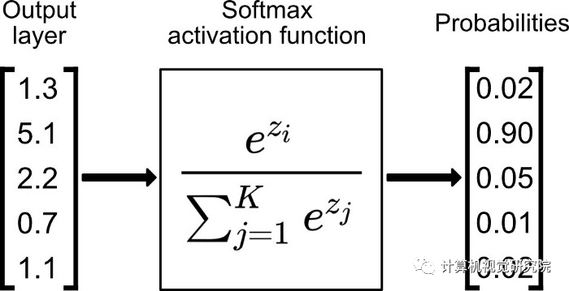

## Keras简介

Keras是基于TensorFlow和Theano（由加拿大蒙特利尔大学开发的机器学习框架）的深度学习库，是由纯python编写而成的高层神经网络API，也仅支持
python开发。它是为了支持快速实践而对tensorflow或者Theano的再次封装，让我们可以不用关注过多的底层细节，能够把想法快速转换为结果。它也很
灵活，且比较容易学。Keras默认的后端为tensorflow，如果想要使用theano可以自行更改。tensorflow和theano都可以使用GPU进行硬件加速，往往
可以比CPU运算快很多倍。因此如果你的显卡支持cuda的话，建议尽可能利用cuda加速模型训练。（当机器上有可用的GPU时，代码会自动调用GPU 进行并行 计算。）目前Keras已经被TensorFlow收录，添加到TensorFlow
中，成为其默认的框架，成为TensorFlow官方的高级API。

## 环境安装

安装方式：因为笔者使用的 anaconda 对 python 环境进行控制的。所以，先创建了一个 python == 3.8 环境(Windows 10)

1. conda create -n your_env_name python=x.x 例如 conda create -n tf python=3.8
2. 激活环境 conda activate your_env_name 例如 conda activate tf
3. 进入环境以后输入：pip install tensorflow==2.x.0

## Keras Moddel

在 Keras 中有两类主要的模型：Sequential 顺序模型 和 使用函数式 API 的 Model 类模型。 这些模型有许多共同的方法和属性：

- model.layers 是包含模型网络层的展平列表。
- model.inputs 是模型输入张量的列表。
- model.outputs 是模型输出张量的列表。
- model.summary() 打印出模型概述信息。 它是 utils.print_summary 的简捷调用。
- model.get_config() 返回包含模型配置信息的字典。
- model.get_weights() 返回模型中所有权重张量的列表，类型为 Numpy 数组。
- model.set_weights(weights) 从 Numpy 数组中为模型设置权重。列表中的数组必须与 get_weights() 返回的权重具有相同的尺寸。
- model.to_json() 以 JSON 字符串的形式返回模型的表示。请注意，该表示不包括权重，仅包含结构。你可以通过以下方式从 JSON 字符串 重新实例化同一模型（使用重新初始化的权重）：
- model.to_yaml() 以 YAML 字符串的形式返回模型的表示。请注意，该表示不包括权重，只包含结构。
- model.save_weights(filepath) 将模型权重存储为 HDF5 文件。
- model.load_weights(filepath, by_name=False): 从 HDF5 文件（由 save_weights 创建）中加载权重。默认情况下，模型的结 构应该是不变的。
  如果想将权重载入不同的模型（部分层相同）， 设置 by_name=True 来载入那些名字相同的层的权重。

## Sequential 顺序模型

创建模型： model = tf.keras.Sequential()

### model.complie() 编译函数用于配置训练模型

    compile(optimizer, loss=None, metrics=None, loss_weights=None, sample_weight_mode=None, 
        weighted_metrics=None, target_tensors=None)

    参数：
        optimizer: 字符串（优化器名）或者优化器对象。详见 optimizers。
        loss: 字符串（目标函数名）或目标函数或 Loss 实例。详见 losses。 如果模型具有多个输出，则可以通过传递损失函数的字典或列表，
            在每个输出上使用不同的损失。模型将最小化的损失值将是所有单个损失的总和。
        metrics: 在训练和测试期间的模型评估标准。 通常你会使用 metrics = ['accuracy']。要为多输出模型的不同输出指定不同的评估标准， 
            还可以传递一个字典，如 metrics={'output_a': 'accuracy', 'output_b': ['accuracy', 'mse']}。 你也可以传递一个评
            估指标序列的序列 (len = len(outputs)) 例如 metrics=[['accuracy'], ['accuracy', 'mse']] 或 
            metrics=['accuracy', ['accuracy', 'mse']]。
        loss_weights: 指定标量系数（Python浮点数）的可选列表或字典，用于加权不同模型输出的损失贡献。 模型将要最小化的损失值将是所有单
            个损失的加权和，由 loss_weights 系数加权。 如果是列表，则期望与模型的输出具有 1:1 映射。 如果是字典，则期望将输出名称（字
            符串）映射到标量系数。
        sample_weight_mode: 如果你需要执行按时间步采样权重（2D 权重），请将其设置为 temporal。 默认为 None，为采样权重（1D）。如果
            模型有多个输出，则可以通过传递 mode 的字典或列表，以在每个输出上使用不同的 sample_weight_mode。
        weighted_metrics: 在训练和测试期间，由 sample_weight 或 class_weight 评估和加权的度量标准列表。
        target_tensors: 默认情况下，Keras 将为模型的目标创建一个占位符，在训练过程中将使用目标数据。 相反，如果你想使用自己的目标张量
            （反过来说，Keras 在训练期间不会载入这些目标张量的外部 Numpy 数据）， 您可以通过 target_tensors 参数指定它们。它应该是
            单个张量（对于单输出 Sequential 模型）。
        **kwargs: 当使用 Theano/CNTK 后端时，这些参数被传入 K.function。
                  当使用 TensorFlow 后端时，这些参数被传递到 tf.Session.run。

    异常
        ValueError: 如果 optimizer, loss, metrics 或 sample_weight_mode 这些参数不合法。

### model.fit() 训练函数以固定数量的轮次（数据集上的迭代）训练模型

    fit(x=None, y=None, batch_size=None, epochs=1, verbose=1, callbacks=None, validation_split=0.0, 
        validation_data=None, shuffle=True, class_weight=None, sample_weight=None, initial_epoch=0, 
        steps_per_epoch=None, validation_steps=None, validation_freq=1, max_queue_size=10, workers=1, 
        use_multiprocessing=False)
    
    参数
        x: 输入数据。可以是：
            一个 Numpy 数组（或类数组），或者数组的序列（如果模型有多个输入）。
            一个将名称匹配到对应数组/张量的字典，如果模型具有命名输入。
            一个返回 (inputs, targets) 或 (inputs, targets, sample weights) 的生成器或 keras.utils.Sequence。
            None（默认），如果从本地框架张量馈送（例如 TensorFlow 数据张量）。
        y: 目标数据。它可以是:
            Numpy 数组（序列）、 本地框架张量（序列）、Numpy数组序列（如果模型有多个输出） 
            None（默认）如果从本地框架张量馈送（例如 TensorFlow 数据张量）。 
            如果模型输出层已命名，你也可以传递一个名称匹配Numpy 数组的字典。 
            如果 x 是一个生成器，或 keras.utils.Sequence 实例，则不应该 指定 y（因为目标可以从 x 获得）。
        batch_size: 整数或 None。每次梯度更新的样本数。如果未指定，默认为 32。 
            如果你的数据是符号张量、生成器或 Sequence 实例形式，不要指定 batch_size， 因为它们会生成批次。
        epochs: 整数。训练模型迭代轮次。一个轮次是在整个 x 或 y 上的一轮迭代。 
            请注意，与 initial_epoch 一起，epochs 被理解为「最终轮次」。 
            模型并不是训练了 epochs 轮，而是到第 epochs 轮停止训练。
        verbose: 整数，0, 1 或 2。日志显示模式。 0 = 安静模式, 1 = 进度条, 2 = 每轮一行。
        callbacks: 一系列的 keras.callbacks.Callback 实例。一系列可以在训练和验证（如果有）时使用的回调函数。 详见 callbacks。
        validation_split: 0 和 1 之间的浮点数。用作验证集的训练数据的比例。 模型将分出一部分不会被训练的验证数据，
            并将在每一轮结束时评估这些验证数据的误差和任何其他模型指标。 验证数据是混洗之前 x 和y 数据的最后一部分样本中。 
            这个参数在 x 是生成器或 Sequence 实例时不支持。
        validation_data: 用于在每个轮次结束后评估损失和任意指标的数据。 模型不会在这个数据上训练。
            validation_data 会覆盖 validation_split。 validation_data 可以是：
                元组 (x_val, y_val) 或 Numpy 数组或张量
                元组 (x_val, y_val, val_sample_weights) 或 Numpy 数组。
                数据集或数据集迭代器。
            对于前两种情况，必须提供 batch_size。 对于最后一种情况，必须提供 validation_steps。
        shuffle: 布尔值（是否在每轮迭代之前混洗数据）或者字符串 (batch)。 batch 是处理 HDF5 数据限制的特殊选项，
            它对一个 batch 内部的数据进行混洗。 当 steps_per_epoch 非 None 时，这个参数无效。
        class_weight: 可选的字典，用来映射类索引（整数）到权重（浮点）值，用于加权损失函数（仅在训练期间）。 
            这可能有助于告诉模型来自代表性不足的类的样本。
        sample_weight: 训练样本的可选 Numpy 权重数组，用于对损失函数进行加权（仅在训练期间）。 
            你可以传递与输入样本长度相同的平坦（1D）Numpy 数组（权重和样本之间的 1:1 映射）， 
            或者在时序数据的情况下，可以传递尺寸为 (samples, sequence_length) 的 2D 数组，以对每个样本的每个时间步施加不同的权重。
            在这种情况下，你应该确保在 compile() 中指定 sample_weight_mode="temporal"。 
            这个参数在 x 是生成器或 Sequence 实例时不支持，应该提供 sample_weights 作为 x 的第 3 元素。
        initial_epoch: 整数。开始训练的轮次（有助于恢复之前的训练）。
        steps_per_epoch: 整数或 None。 在声明一个轮次完成并开始下一个轮次之前的总步数（样品批次）。 
            使用 TensorFlow 数据张量等输入张量进行训练时，默认值 None 等于数据集中样本的数量除以 batch 的大小，如果无法确定，则为 1。
        validation_steps: 只有在提供了 validation_data 并且是一个生成器时才有用。 表示在每个轮次结束时执行验证时，
            在停止之前要执行的步骤总数（样本批次）。
        validation_freq: 只有在提供了验证数据时才有用。整数或列表/元组/集合。 
            如果是整数，指定在新的验证执行之前要执行多少次训练，例如，validation_freq=2 在每 2 轮训练后执行验证。 
            如果是列表、元组或集合，指定执行验证的轮次，例如，validation_freq=[1, 2, 10] 表示在第 1、2、10 轮训练后执行验证。
        max_queue_size: 整数。仅用于生成器或 keras.utils.Sequence 输入。 生成器队列的最大尺寸。
            若未指定，max_queue_size 将默认为 10。
        workers: 整数。仅用于生成器或 keras.utils.Sequence 输入。 当使用基于进程的多线程时的最大进程数。
            若未指定，workers 将默认为 1。若为 0，将在主线程执行生成器。
        use_multiprocessing: 布尔值。仅用于生成器或 keras.utils.Sequence 输入。 如果是 True，使用基于进程的多线程。
            若未指定，use_multiprocessing 将默认为 False。 注意由于这个实现依赖于 multiprocessing，
            你不应该像生成器传递不可选的参数，因为它们不能轻松地传递给子进程。
        **kwargs: 用于向后兼容。

    返回
        一个 History 对象。其 History.history 属性是连续 epoch 训练损失和评估值，以及验证集损失和评估值的记录（如果适用）。

    异常 
        RuntimeError: 如果模型从未编译。
        ValueError: 在提供的输入数据与模型期望的不匹配的情况下。

### model.evaluate() 评估函数返回误差值和评估标准值

    evaluate(x=None, y=None, batch_size=None, verbose=1, sample_weight=None, steps=None, 
        callbacks=None, max_queue_size=10, workers=1, use_multiprocessing=False)

    参数：
        x: 输入数据。可以是：
            一个 Numpy 数组（或类数组），或者数组的序列（如果模型有多个输入）。
            一个将名称匹配到对应数组/张量的字典，如果模型具有命名输入。
            一个返回 (inputs, targets) 或 (inputs, targets, sample weights) 的生成器或 keras.utils.Sequence。
            None（默认），如果从本地框架张量馈送（例如 TensorFlow 数据张量）。
        y: 目标数据。与输入数据 x 类似，它可以是 Numpy 数组（序列）、 本地框架张量（序列）、Numpy数组序列（如果模型有多个输出） 
            或 None（默认）如果从本地框架张量馈送（例如 TensorFlow 数据张量）。 如果模型输出层已命名，你也可以传递一个名称匹配
            Numpy 数组的字典。 如果 x 是一个生成器，或 keras.utils.Sequence 实例，则不应该 指定 y（因为目标可以从 x 获得）。
        batch_size: 整数或 None。每次梯度更新的样本数。如果未指定，默认为 32。 如果你的数据是符号张量、生成器或 Sequence 实例形式，
            不要指定 batch_size， 因为它们会生成批次。
        verbose: 0, 1。日志显示模式。0 = 安静模式, 1 = 进度条。
        sample_weight: 训练样本的可选 Numpy 权重数组，用于对损失函数进行加权。 你可以传递与输入样本长度相同的平坦（1D）Numpy 数组
            （权重和样本之间的 1:1 映射）， 或者在时序数据的情况下，可以传递尺寸为 (samples, sequence_length) 的 2D 数组，以对每
            个样本的每个时间步施加不同的权重。 在这种情况下，你应该确保在 compile() 中指定 sample_weight_mode="temporal"。
        steps: 整数或 None。 声明评估结束之前的总步数（批次样本）。默认值 None 时被忽略。
        callbacks: 一系列的 keras.callbacks.Callback 实例。一系列可以在评估时使用的回调函数。 详见 callbacks。
        max_queue_size: 整数。仅用于生成器或 keras.utils.Sequence 输入。 
            生成器队列的最大尺寸。若未指定，max_queue_size 将默认为 10。
        workers: 整数。仅用于生成器或 keras.utils.Sequence 输入。 当使用基于进程的多线程时的最大进程数。
            若未指定，workers 将默认为 1。若为 0，将在主线程执行生成器。
        use_multiprocessing: 布尔值。仅用于生成器或 keras.utils.Sequence 输入。 如果是 True，使用基于进程的多线程。
            若未指定，use_multiprocessing 将默认为 False。 注意由于这个实现依赖于 multiprocessing，你不应该像生成器传递
            不可选的参数，因为它们不能轻松地传递给子进程。

    异常
        ValueError: 若参数非法。

    返回 
        标量测试误差（如果模型只有单个输出且没有评估指标）或标量列表（如果模型具有多个输出和/或指标）。 
        属性 model.metrics_names 将提供标量输出的显示标签。

### mdoel.predict() 预测函数通过输入样本生成输出预测

    predict(x, batch_size=None, verbose=0, steps=None, callbacks=None, max_queue_size=10, 
        workers=1, use_multiprocessing=False)

    参数
        x: 输入数据。可以是：
            一个 Numpy 数组（或类数组），或者数组的序列（如果模型有多个输入）。
            一个将名称匹配到对应数组/张量的字典，如果模型具有命名输入。
            一个返回 (inputs, targets) 或 (inputs, targets, sample weights) 的生成器或 keras.utils.Sequence。
            None（默认），如果从本地框架张量馈送（例如 TensorFlow 数据张量）。
        batch_size: 整数或 None。每次梯度更新的样本数。如果未指定，默认为 32。 如果你的数据是符号张量、生成器或 Sequence 实例形式，
            不要指定 batch_size， 因为它们会生成批次。
        verbose: 日志显示模式，0 或 1。
        steps: 声明预测结束之前的总步数（批次样本）。默认值 None 时被忽略。
        callbacks: 一系列的 keras.callbacks.Callback 实例。一系列可以在预测时使用的回调函数。 详见 callbacks。
        max_queue_size: 整数。仅用于生成器或 keras.utils.Sequence 输入。 生成器队列的最大尺寸。
            若未指定，max_queue_size 将默认为 10。
        workers: 整数。仅用于生成器或 keras.utils.Sequence 输入。 当使用基于进程的多线程时的最大进程数。
            若未指定，workers 将默认为 1。若为 0，将在主线程执行生成器。
        use_multiprocessing: 布尔值。仅用于生成器或 keras.utils.Sequence 输入。 如果是 True，使用基于进程的多线程。
            若未指定，use_multiprocessing 将默认为 False。 注意由于这个实现依赖于 multiprocessing，你不应该像生成器传递不可选
            的参数，因为它们不能轻松地传递给子进程。

    返回
        预测的 Numpy 数组。
        
    异常
        ValueError: 如果提供的输入数据与模型的期望数据不匹配，或者有状态模型收到的数量不是批量大小的倍数。

### 一个案例

```python
# 完整的Keras Sequential 顺序模型
import numpy as np
from tensorflow.keras.models import Sequential
from tensorflow.keras.layers import Dense, Dropout

# 生成虚拟数据
x_train = np.random.random((1000, 20))
y_train = np.random.randint(2, size=(1000, 1))
x_test = np.random.random((100, 20))
y_test = np.random.randint(2, size=(100, 1))

# model 构建
model = Sequential()

# 添加神经网络层
model.add(Dense(64, input_dim=20, activation='relu'))
model.add(Dropout(0.5))
model.add(Dense(64, activation='relu'))
model.add(Dropout(0.5))
model.add(Dense(1, activation='sigmoid'))

# model.complile() 函数用于模型编译
model.compile(loss='binary_crossentropy', optimizer='rmsprop', metrics=['accuracy'])

# model.fit() 函数用于模型训练
model.fit(x_train, y_train, epochs=20, batch_size=128)

# model.evaluate() 函数用于模型评估
score = model.evaluate(x_test, y_test, batch_size=128)

# model.predict() 函数用于预测
result = model.predict(x_test)
```

## function API 模型

```python
# 在函数式 API 中，自己需要给定一些输入张量和输出张量，可以通过以下方式实例化一个 Model：

from tensorflow.keras.models import Model
from tensorflow.keras.layers import Input, Dense

# 这个模型将包含从 a 到 b 的计算的所有网络层。
a = Input(shape=(32,))
b = Dense(32)(a)
model = Model(inputs=a, outputs=b)

# 在多输入或多输出模型的情况下，也可以使用列表：
model = Model(inputs=[a1, a2], outputs=[b1, b3, b3])
```

函数式 API 的 Model 类模型对应函数参数可以参考 model.Sequential() 顺序模型：model.compile(), model.fit(), mdoel.evaluate(), model.predict()

### 一个例子

以下是函数式 API 的一个很好的例子：具有多个输入和输出的模型。函数式 API 使处理大量交织的数据流变得容易。 在这个例子中，我们试图预测 Twitter
上的一条新闻标题有多少转发和点赞数。模型的主要输入将是新闻标题本身，即一系列词语， 但是为了增添趣味，我们的模型还添加了其他的辅助输入来接收额外的数据，例如新闻标题的发布的时间等。
该模型也将通过两个损失函数进行监督学习。较早地在模型中使用主损失函数（参见loss部分内容），是深度学习模型的一个良好正则方法。

模型结构如下图所示：


```python
# Coding
import tensorflow as tf
from tensorflow.keras.layers import Input, Embedding, LSTM, Dense
from tensorflow.keras.models import Model
import numpy as np

np.random.seed(0)  # 设置随机种子，用于复现结果

# 创建数据
headline_data = np.round(np.abs(np.random.rand(12, 100) * 100))
additional_data = np.random.randn(12, 5)
headline_labels = np.random.randn(12, 1)
additional_labels = np.random.randn(12, 1)

#  开始构建模型网络
# 输入层：通过标题输入，接收一个含有 100 个整数的序列，每个整数在 1 到 10000 之间, 在这里可以通过传递一个 "name" 参数来命名任何层。
main_input = Input(shape=(100,), dtype='int32', name='main_input')

# Embedding 层将输入序列编码为一个稠密向量的序列，每个向量维度为 512。 该层为模型中的：embedding_1(Embedding)
embedding_out = Embedding(output_dim=512, input_dim=10000, input_length=100)(main_input)

# LSTM 层把向量序列转换成单个向量，它包含整个序列的上下文信息
lstm_out = LSTM(32)(embedding_out)

# 插入辅助损失，使得即使在模型主损失很高的情况下，LSTM 层和 Embedding 层都能被平稳地训练。该层为模型中的：aux_output(Dense)
aux_output = Dense(1, activation='sigmoid', name='aux_output')(lstm_out)

# 辅助输入数据与 LSTM 层的输出连接起来，输入到模型中,该层为模型中的：aux_input(InputLayer)
aux_input = Input(shape=(5,), name='aux_input')

# 模型中的：merge_1(Merge) 将辅助输入数据与 LSTM 层的输出连接起来
merge_out = tf.keras.layers.concatenate([lstm_out, aux_input])

# 堆叠多个全连接网络层模型中的：dense_1, dense_2, dense_3
dense1 = Dense(64, activation='relu')(merge_out)
dense2 = Dense(64, activation='relu')(dense1)
dense3 = Dense(64, activation='relu')(dense2)

# 最后添加主要的逻辑回归层, 模型中的 main_output(Dense)
main_output = Dense(1, activation='sigmoid', name='main_output')(dense3)

# 定义一个具有两个输入和两个输出的模型
model = Model(inputs=[main_input, aux_input], outputs=[main_output, aux_output])

# 模型编译，训练，预测
model.compile(optimizer='rmsprop', loss='binary_crossentropy', loss_weights=[1., 0.2])

model.fit([headline_data, additional_data], [headline_labels, additional_labels], epochs=50, batch_size=32)

pred = model.predict([headline_data, additional_data])

# 由于输入和输出均被命名了（在定义时传递了一个 name 参数），我们也可以通过以下方式编译模型：
# model.compile(optimizer='rmsprop',
#               loss={'main_output': 'binary_crossentropy', 'aux_output': 'binary_crossentropy'},
#               loss_weights={'main_output': 1., 'aux_output': 0.2})

# model.fit({'main_input': headline_data, 'aux_input': additional_data},
#           {'main_output': headline_labels, 'aux_output': additional_labels},
#           epochs=50, batch_size=32)

# model.predict({'main_input': headline_data, 'aux_input': additional_data})
```

## Activation：激活函数

内容部分参考了：计算机视觉战队（微信公众号：ComputerVisionGzq），作者：Edison_G 地址：https://cloud.tencent.com/developer/article/1800954

### 使用方式有两种：

1, tf.keras.layers.Conv2D(64, (3, 3), activation='elu')  
2, tf.keras.activations.elu(x, alpha=1.0)

### 激活函数种类

激活函数（Activation Function）是一种添加到人工神经网络中的函数，旨在帮助网络学习数据中的复杂模式。类似于人类大脑中基于神经元的模型，激活函数最终决定了要发射给下一个神经元的内容。
在人工神经网络中，一个节点的激活函数定义了该节点在给定的输入或输入集合下的输出。标准的计算机芯片电路可以看作是根据输入得到开（1）或关（0）输出的数字电路激活函数。因此，激活函数是确定神经网络输出的数学方程

人工神经元的工作原理


数学工作原理


#### 1 Sigmoid 激活函数


函数表达式：: sigmoid(x) = 1 / (1 + exp(-x))  
优点：

- Sigmoid 函数的输出范围是 0 到 1。由于输出值限定在 0 到 1，因此它对每个神经元的输出进行了归一化；
- 用于将预测概率作为输出的模型。由于概率的取值范围是 0 到 1，因此 Sigmoid 函数非常合适；
- 梯度平滑，避免「跳跃」的输出值；
- 函数是可微的。这意味着可以找到任意两个点的 sigmoid 曲线的斜率；
- 明确的预测，即非常接近 1 或 0。

缺点

- 倾向于梯度消失；
- 函数输出不是以 0 为中心的，这会降低权重更新的效率；
- Sigmoid 函数执行指数运算，计算机运行得较慢。

#### 2 Tanh / 双曲正切激活函数


函数表达式：


tanh VS sigmoid


当输入较大或较小时，输出几乎是平滑的并且梯度较小，这不利于权重更新。二者的区别在于输出间隔，tanh 的输出间隔为 1，并且整个函数以 0 为中心，比 sigmoid 函数更好；

- 在 tanh 图中，负输入将被强映射为负，而零输入被映射为接近零。

注意：在一般的二元分类问题中，tanh 函数用于隐藏层，而 sigmoid 函数用于输出层，但这并不是固定的，需要根据特定问题进行调整。

#### 3 ReLU 激活函数


函数表达式：

ReLU 函数是深度学习中较为流行的一种激活函数，相比于 sigmoid 函数和 tanh 函数，它具有如下优点：

- 当输入为正时，不存在梯度饱和问题。
- 计算速度快得多。ReLU 函数中只存在线性关系，因此它的计算速度比 sigmoid 和 tanh 更快。

缺点：

- 当输入为负时，ReLU 完全失效，在正向传播过程中，这不是问题。有些区域很敏感，有些则不敏感。但是在反向传播过程中，如果输入负数，则梯度将完全为零，sigmoid 函数和 tanh 函数也具有相同的问题；
- ReLU 函数的输出为 0 或正数，这意味着 ReLU 函数不是以 0 为中心的函数。

#### 4 Leaky ReLU 激活函数


函数表达式：


leaky relu 比 relu 函数更好的地方： 因为，Leaky ReLU 通过把 x 的非常小的线性分量给予负输入（0.01x）来调整负值的零梯度（zero gradients）问题；

- leak 有助于扩大 ReLU 函数的范围，通常 a 的值为 0.01 左右；
- Leaky ReLU 的函数范围是（负无穷到正无穷）。

注意：从理论上讲，Leaky ReLU 具有 ReLU 的所有优点，而且 Dead ReLU 不会有任何问题，但在实际操作中，尚未完全证明 Leaky ReLU 总是比 ReLU 更好。

#### 5 elu 激活函数


函数表达式：


据图可以看出，ELU 具有 ReLU 的所有优点，并且：

- 没有 Dead ReLU 问题，输出的平均值接近 0，以 0 为中心；
- ELU 通过减少偏置偏移的影响，使正常梯度更接近于单位自然梯度，从而使均值向零加速学习；
- ELU 在较小的输入下会饱和至负值，从而减少前向传播的变异和信息。

一个小问题是它的计算强度更高。与 Leaky ReLU 类似，尽管理论上比 ReLU 要好，但目前在实践中没有充分的证据表明 ELU 总是比 ReLU 好。

#### 6 softmax 激活函数


函数表达式：


Softmax 是用于多类分类问题的激活函数，在多类分类问题中，超过两个类标签则需要类成员关系。对于长度为 K 的任意实向量，Softmax 可以将其压缩为长度为 K，值在（0，1）范围内，并且向量中元素的总和为 1 的实向量。

Softmax 与正常的 max 函数不同：max 函数仅输出最大值，但 Softmax 确保较小的值具有较小的概率，并且不会直接丢弃。我们可以认为它是 argmax 函数的概率版本或「soft」版本。

Softmax 函数的分母结合了原始输出值的所有因子，这意味着 Softmax 函数获得的各种概率彼此相关。

Softmax 激活函数的主要缺点是：

- 在零点不可微；
- 负输入的梯度为零，这意味着对于该区域的激活，权重不会在反向传播期间更新，因此会产生永不激活的死亡神经元。

#### 7 Softplus 激活函数


函数表达式： f（x）= ln（1 + exp x）

Softplus 的导数为: f ′(x)= 1/ (1 +exp(−x )) ，也称为 logistic / sigmoid 函数。

Softplus 函数类似于 ReLU 函数，但是相对较平滑，像 ReLU 一样是单侧抑制。它的接受范围很广：(0, + inf)。

#### 8 Swish 激活函数


函数表达式：y = x * sigmoid (x)

Swish 的设计受到了 LSTM 和高速网络中 gating 的 sigmoid 函数使用的启发。我们使用相同的 gating 值来简化 gating 机制，这称为 self-gating。

self-gating 的优点在于它只需要简单的标量输入，而普通的 gating 则需要多个标量输入。这使得诸如 Swish 之类的 self-gated激活函数能够轻松替换以单个标量为输入的激活函数（例如
ReLU），而无需更改隐藏容量或参数数量。

Swish 激活函数的主要优点如下：

- 「无界性」有助于防止慢速训练期间，梯度逐渐接近 0 并导致饱和；（同时，有界性也是有优势的，因为有界激活函数可以具有很强的正则化，并且较大的负输入问题也能解决）；
- 导数恒 > 0；
- 平滑度在优化和泛化中起了重要作用。

## callback (回调)

    暂无

## initializers

    暂无

## Layer

### Dense（全连接层）

     tf.keras.layers.Dense(units, activation=None, use_bias=True, kernel_initializer='glorot_uniform',
        bias_initializer='zeros', kernel_regularizer=None, bias_regularizer=None, activity_regularizer=None,
        kernel_constraint=None, bias_constraint=None)

    参数：
        units: 正整数，输出空间维度。
        activation: 激活函数 (详见 activations)。 若不指定，则不使用激活函数 (即，线性激活: a(x) = x)。
        use_bias: 布尔值，该层是否使用偏置向量。
        kernel_initializer: kernel 权值矩阵的初始化器 (详见 initializers)。
        bias_initializer: 偏置向量的初始化器 (详见 initializers)。
        kernel_regularizer: 运用到 kernel 权值矩阵的正则化函数 (详见 regularizer)。
        bias_regularizer: 运用到偏置向量的的正则化函数 (详见 regularizer)。
        activity_regularizer: 运用到层的输出的正则化函数 (它的 "activation")。 (详见 regularizer)。
        kernel_constraint: 运用到 kernel 权值矩阵的约束函数 (详见 constraints)。
        bias_constraint: 运用到偏置向量的约束函数 (详见 constraints)。

    输入
        形如(batch_size, ..., input_dim)的 nD 张量，最常见的情况为(batch_size, input_dim)的 2D 张量
        
    输出
        形如(batch_size, ..., units)的 nD 张量，最常见的情况为(batch_size, units)的 2D 张量

```python
# demo
import tensorflow as tf

# 创建一个模型，并且采用 shape= (None, 16) 的输入数组, 输出数组为 shape=(None, 32)。注意在第一层之后，你不需要再指定输入的大小了：
model = tf.keras.models.Sequential()
model.add(tf.keras.Input(shape=(16,)))
model.add(tf.keras.layers.Dense(32, activation='relu'))
model.add(tf.keras.layers.Dense(32))
print(model.output_shape)  # (None, 32)
```

### Conv1D (一维卷积层)

    作用：

    函数：tf.keras.layers.Conv1D(
            filters, kernel_size, strides=1, padding='valid',
            data_format='channels_last', dilation_rate=1, groups=1,
            activation=None, use_bias=True, kernel_initializer='glorot_uniform',
            bias_initializer='zeros', kernel_regularizer=None,
            bias_regularizer=None, activity_regularizer=None, kernel_constraint=None,
            bias_constraint=None, **kwargs
        )
    
    参数: 
        filters:  整数，输出空间的维度（即卷积中输出滤波器的数量）
        kernel_size:  单个整数的整数或元组列表，指定一维卷积窗口的长度
        strides:	一个整数或单个整数的元组列表，指定卷积的步长。指定任何 stride 值 != 1 与指定任何 dilation_rate 值 != 1 不兼容。
        padding:	"valid" 意味着没有填充。 , "same" 导致在输入的左/右或上/下均匀填充零，以使输出具有与输入相同的高度/宽度尺寸。
                    "causal" 导致因果（扩张）卷积，例如输出[t] 不依赖于输入[t+1:]。在模型不应违反时间顺序的时间数据建模时很有用。
        data_format:	一个字符串，channels_last（默认）或 channels_first 之一。
        dilation_rate:	一个整数或单个整数的元组/列表，指定用于扩张卷积的扩张率。
                        目前，指定任何 dilation_rate 值 != 1 与指定任何 strides 值 != 1 是不兼容的。
        groups:	 一个正整数，指定输入沿通道轴拆分的组数。每个组分别与 filters / groups filters 进行卷积。
                输出是沿通道轴的所有组结果的串联。输入通道和过滤器都必须可以按组整除。
        activation:	要使用的激活功能。如果您未指定任何内容，则不会应用激活
        use_bias:	bool，层是否使用偏置向量。
        kernel_initializer:	内核权重矩阵的初始化程序（请参阅 keras.initializers）。默认为“glorot_uniform”。
        bias_initializer:	偏置向量的初始化程序。 默认为“zero”。
        kernel_regularizer:	应用于内核权重矩阵的正则化函数
        bias_regularizer:	应用于偏置向量的正则化函数
        activity_regularizer:	正则化函数应用于层的输出 (its "activation")
        kernel_constraint:	应用于核矩阵的约束函数
        bias_constraint:	应用于偏置向量的约束函数

    输入shape
        形如（samples，steps，input_dim）的3D张量
        
    输出shape
        形如（samples，new_steps，nb_filter）的3D张量，因为有向量填充的原因，steps的值会改变

```python
# demo
import tensorflow as tf

# 输入是 128 个长度的向量，有 10 个时间步长，批量大小为 4
input_shape = (4, 10, 128)
x = tf.random.normal(input_shape)
y = tf.keras.layers.Conv1D(32, 3, activation='relu', input_shape=input_shape[1:])(x)
print(y.shape)  # (4,8,32)
```

### conv2D（二维卷积层）

    作用：二维卷积层，即对图像的空域卷积。该层对二维输入进行滑动窗卷积，当使用该层作为第一层时，应提供input_shape参数。
        例如input_shape = (128,128,3)代表128*128的彩色RGB图像

    使用方法： 
        tf.keras.layers.Conv2D(
            filters, kernel_size, strides=(1, 1), padding='valid',
            data_format=None, dilation_rate=(1, 1), groups=1, activation=None,
            use_bias=True, kernel_initializer='glorot_uniform',
            bias_initializer='zeros', kernel_regularizer=None,
            bias_regularizer=None, activity_regularizer=None, kernel_constraint=None,
            bias_constraint=None, **kwargs
        )

    参数：
        filters：卷积核的数目（即输出的维度）
        kernel_size：单个整数或由两个整数构成的list/tuple，卷积核的宽度和长度。
                    如为单个整数，则表示在各个空间维度的相同长度。
        strides：单个整数或由两个整数构成的list/tuple，为卷积的步长。如为单个整数，则表示在各个空间维度的相同步长。
                任何不为1的strides均与任何不为1的dilation_rate均不兼容
        padding：补0策略，为“valid”, “same” 。“valid”代表只进行有效的卷积，即对边界数据不处理。
                “same”代表保留边界处的卷积结果，通常会导致输出shape与输入shape相同。
        activation：激活函数，为预定义的激活函数名（参考激活函数）。
                如果不指定该参数，将不会使用任何激活函数（即使用线性激活函数：a(x)=x）
        dilation_rate：单个整数或由两个个整数构成的list/tuple，指定dilated convolution中的膨胀比例。
                任何不为1的dilation_rate均与任何不为1的strides均不兼容。
        data_format： 字符串，“channels_first”或“channels_last”之一，代表图像的通道维的位置。
                该参数是Keras 1.x中的image_dim_ordering，“channels_last”对应原本的“tf”，“channels_first”对应原本的“th”。
                以128x128的RGB图像为例，“channels_first”应将数据组织为（3,128,128），而“channels_last”应将数据组织为（128,128,3）。
                该参数的默认值是~/.keras/keras.json中设置的值，若从未设置过，则为“channels_last”。
        use_bias:  布尔值，是否使用偏置项
        kernel_initializer：  权值初始化方法，为预定义初始化方法名的字符串，或用于初始化权重的初始化器。参考initializers
        bias_initializer：  权值初始化方法，为预定义初始化方法名的字符串，或用于初始化权重的初始化器。参考initializers
        kernel_regularizer：  施加在权重上的正则项，为Regularizer对象
        bias_regularizer：  施加在偏置向量上的正则项，为Regularizer对象
        activity_regularizer：  施加在输出上的正则项，为Regularizer对象
        kernel_constraints：  施加在权重上的约束项，为Constraints对象
        bias_constraints：  施加在偏置上的约束项，为Constraints对象

    输入shape
        ‘channels_first’模式下，输入形如（samples,channels，rows，cols）的4D张量
        ‘channels_last’模式下，输入形如（samples，rows，cols，channels）的4D张量
        注意这里的输入shape指的是函数内部实现的输入shape，而非函数接口应指定的input_shape，请参考下面提供的例子。
        
    输出shape
        ‘channels_first’模式下，为形如（samples，nb_filter, new_rows, new_cols）的4D张量
        ‘channels_last’模式下，为形如（samples，new_rows, new_cols，nb_filter）的4D张量
        输出的行列数可能会因为填充方法而改变

```python
import tensorflow as tf

# The inputs are 28x28 RGB images with `channels_last` and the batch size is 4.
input_shape = (4, 28, 28, 3)
x = tf.random.normal(input_shape)
y = tf.keras.layers.Conv2D(2, 3, activation='relu', input_shape=input_shape[1:])(x)
print(y.shape)  # (4,24,24,2)

# With `padding` as "same".
input_shape = (4, 28, 28, 3)
x = tf.random.normal(input_shape)
y = tf.keras.layers.Conv2D(2, 3, activation='relu', padding="same", input_shape=input_shape[1:])(x)
print(y.shape)  # (4,28,28,2)

```

### Dropout 层

    作用：为输入数据施加Dropout。Dropout将在训练过程中每次更新参数时按一定概率（rate）随机断开输入神经元，Dropout层用于防止过拟合。

    使用方式：tf.keras.layers.Dropout(rate, noise_shape=None, seed=None)

    参数：
        rate: 在 0 和 1 之间浮动。需要丢弃的输入比例。
        noise_shape: 1D 整数张量， 表示将与输入相乘的二进制 dropout 掩层的形状。 
            例如，如果输入尺寸为 (batch_size, timesteps, features)。然后,希望 dropout 掩层在所有时间步都是一样的， 
            可以使用 noise_shape=(batch_size, 1, features)。
        seed: 一个作为随机种子的 Python 整数。

### Flatten （平坦层）

    作用：Flatten层用来将输入“压平”，即把多维的输入一维化，常用在从卷积层到全连接层的过渡。Flatten不影响batch的大小。

    使用方式：tf.keras.layers.Flatten(data_format=None)

    参数：
        data_format：一个字符串，其值为 channels_last（默认值）或者 channels_first。它表明输入的维度的顺序。
        此参数的目的是当模型从一种数据格式切换到另一种数据格式时保留权重顺序。
        channels_last 对应着尺寸为 (batch, ..., channels) 的输入，
        channels_first 对应着尺寸为 (batch, channels, ...) 的输入。
        默认为 image_data_format 的值，你可以在 Keras 的配置文件 ~/.keras/keras.json 中找到它。
        如果，从未设置过它，那么它将是 channels_last

    示例：
        model = Sequential()
        model.add(Conv2D(64, (3, 3), input_shape=(3, 32, 32), padding='same',))
        # 现在：model.output_shape == (None, 64, 32, 32)
        
        model.add(Flatten())
        # 现在：model.output_shape == (None, 65536) 64 * 32 * 32 = 65536

### reshape 层

    作用：Reshape层用来将输入shape转换为特定的shape

    函数使用：
        tf.keras.layers.Reshape(target_shape, **kwargs)

    参数
    target_shape：目标shape，为整数的tuple，不包含样本数目的维度（batch大小）

    输入shape
        尽管输入形状中的所有维度都必须是已知/固定的。 
        将此层用作模型中的第一层时，请使用关键字参数 input_shape（整数元组，不包括样本/批量大小轴）。
    
    输出shape
        (batch_size,) + target_shape

```python
import tensorflow as tf

model = tf.keras.Sequential()
model.add(tf.keras.layers.Reshape((3, 4), input_shape=(12,)))
print(model.output_shape)  # shape=(None,3,4)
```

### embedding (嵌入层)

    作用：嵌入层将正整数（下标）转换为具有固定大小的向量，如[[4],[20]]->[[0.25,0.1],[0.6,-0.2]] Embedding层只能作为模型的第一层

    函数使用：
        tf.keras.layers.Embedding(
            input_dim, output_dim, embeddings_initializer='uniform',
            embeddings_regularizer=None, activity_regularizer=None,
            embeddings_constraint=None, mask_zero=False, input_length=None, **kwargs
        )
    
    参数：
        input_dim： 大或等于0的整数，字典长度，即输入数据最大下标+1
        output_dim： 大于0的整数，代表全连接嵌入的维度
        embeddings_initializer:  嵌入矩阵的初始化方法，为预定义初始化方法名的字符串，或用于初始化权重的初始化器。参考initializers
        embeddings_regularizer:  嵌入矩阵的正则项，为Regularizer对象
        embeddings_constraint:  嵌入矩阵的约束项，为Constraints对象
        mask_zero： bool，确定是否将输入中的‘0’看作是应该被忽略的‘填充’（padding）值，该参数在使用递归层处理变长输入时有用。
                    设置为True的话，模型中后续的层必须都支持masking，否则会抛出异常。如果该值为True，则下标0在字典中不可用，
                    input_dim应设置为|vocabulary| + 1。
        input_length： 当输入序列的长度固定时，该值为其长度。如果要在该层后接Flatten层，然后接Dense层，则必须指定该参数，
                    否则Dense层的输出维度无法自动推断。

    输入shape
        形如（samples，sequence_length）的2D张量
        
    输出shape
        形如(samples, sequence_length, output_dim)的3D张量

```python
import tensorflow as tf
import numpy as np

# 该模型将输入一个大小为 (batch, input_length) 的整数矩阵，输入中的最大整数（即单词索引）不应大于 999（词汇大小）。 
# 现在 model.output_shape 是 (None, 10, 64)，其中 `None` 是批次维度。
model = tf.keras.Sequential()
model.add(tf.keras.layers.Embedding(1000, 64, input_length=10))
input_array = np.random.randint(1000, size=(32, 10))
model.compile('rmsprop', 'mse')
output_array = model.predict(input_array)
print(output_array.shape)  # (32, 10, 64)
```

### maxPooling1D

    作用：对时域1D信号进行最大值池化

    函数使用：
        tf.keras.layers.MaxPool1D(
            pool_size=2, strides=None, padding='valid',
            data_format='channels_last', **kwargs
        )
    参数
        pool_size：整数，池化窗口大小
        strides：整数或None，下采样因子，例如设2将会使得输出shape为输入的一半，若为None则默认值为pool_size。
        padding：‘valid’或者‘same’。 “valid”意味着没有填充。 “same”导致向左均匀填充 
        
    输入shape
        形如（samples，steps，features）的3D张量

    输出shape
        形如（samples，downsampled_steps，features）的3D张量

```python
import tensorflow as tf

# demo1
x = tf.constant([1., 2., 3., 4., 5.])
x = tf.reshape(x, [1, 5, 1])
max_pool_1d = tf.keras.layers.MaxPooling1D(pool_size=2, strides=1, padding='valid')
print(max_pool_1d(x))  # shape = (1,4,1)  array=[[[2],[3],[4],[5]]]

# demo2
x = tf.constant([1., 2., 3., 4., 5.])
x = tf.reshape(x, [1, 5, 1])
max_pool_1d = tf.keras.layers.MaxPooling1D(pool_size=2, strides=1, padding='same')
print(max_pool_1d(x))  # shape = (1,5,1)  array=[[[2],[3],[4],[5],[5]]]
```

### maxPooling2D

    作用：为空域信号施加最大值池化

    函数使用：
        tf.keras.layers.MaxPool2D(
            pool_size=(2, 2), strides=None, padding='valid', data_format=None,
            **kwargs
        )
    参数
        pool_size：整数或长为2的整数tuple，代表在两个方向（竖直，水平）上的下采样因子，
                    如取（2，2）将使图片在两个维度上均变为原长的一半。为整数意为各个维度值相同且为该数字。
        strides：整数或长为2的整数tuple，或者None，步长值。
        border_mode：‘valid’或者‘same’. valid 意味着没有填充。same 导致在输入的左/右或上/下均匀填充，以使输出具有与输入相同的高度/宽度尺寸。
        data_format：字符串，“channels_first”或“channels_last”之一，代表图像的通道维的位置。
            该参数是Keras 1.x中的image_dim_ordering，“channels_last”对应原本的“tf”，“channels_first”对应原本的“th”。
            以128x128的RGB图像为例，“channels_first”应将数据组织为（3,128,128），而“channels_last”应将数据组织为（128,128,3）。
            该参数的默认值是~/.keras/keras.json中设置的值，若从未设置过，则为“channels_last”。
    
    输入shape
        ‘channels_first’模式下，为形如（samples，channels, rows，cols）的4D张量
        ‘channels_last’模式下，为形如（samples，rows, cols，channels）的4D张量
    
    输出shape
        ‘channels_first’模式下，为形如（samples，channels, pooled_rows, pooled_cols）的4D张量
        ‘channels_last’模式下，为形如（samples，pooled_rows, pooled_cols，channels）的4D张量

```python
import tensorflow as tf

x = tf.constant([[1., 2., 3.],
                 [4., 5., 6.],
                 [7., 8., 9.]])
x = tf.reshape(x, [1, 3, 3, 1])
max_pool_2d = tf.keras.layers.MaxPooling2D(pool_size=(2, 2), strides=(1, 1), padding='valid')
print(max_pool_2d(x))  # shape=(1,1,2,1) array=[[[[6],[8]]]]
```

### averagePooling1D

    作用： 对时域1D信号进行平均值池化

    函数使用：
        tf.keras.layers.AveragePooling1D(
            pool_size=2, strides=None, padding='valid',
            data_format='channels_last', **kwargs
        )

    参数
        pool_size：整数，池化窗口大小
        strides：整数或None，下采样因子，例如设2将会使得输出shape为输入的一半，若为None则默认值为pool_size。
        padding：‘valid’或者‘same’
    
    输入shape
        形如（samples，steps，features）的3D张量

    输出shape
        形如（samples，downsampled_steps，features）的3D张量

```python
import tensorflow as tf

x = tf.constant([1., 2., 3., 4., 5.])
x = tf.reshape(x, [1, 5, 1])
avg_pool_1d = tf.keras.layers.AveragePooling1D(pool_size=2, strides=1, padding='valid')
print(avg_pool_1d(x))  # shape=(1,4,1) array=[[[1.5],[2.5],[3.5],[4.5]]]
```

### averagePooling2D

    作用：为空域信号施加平均值池化

    函数使用：
        tf.keras.layers.AveragePooling2D(
            pool_size=(2, 2), strides=None, padding='valid', data_format=None,
            **kwargs
        )
    
    参数
        pool_size：整数或长为2的整数tuple，代表在两个方向（竖直，水平）上的下采样因子，如取（2，2）将使图片在两个维度上均变为原长的一半。为整数意为各个维度值相同且为该数字。
        strides：整数或长为2的整数tuple，或者None，步长值。
        border_mode：‘valid’或者‘same’
        data_format：字符串，“channels_first”或“channels_last”之一，代表图像的通道维的位置。

    输入shape
        ‘channels_first’模式下，为形如（samples，channels, rows，cols）的4D张量
        ‘channels_last’模式下，为形如（samples，rows, cols，channels）的4D张量
        
    输出shape
        ‘channels_first’模式下，为形如（samples，channels, pooled_rows, pooled_cols）的4D张量
        ‘channels_last’模式下，为形如（samples，pooled_rows, pooled_cols，channels）的4D张量

```python
import tensorflow as tf

x = tf.constant([[1., 2., 3., 4.],
                 [5., 6., 7., 8.],
                 [9., 10., 11., 12.]])
x = tf.reshape(x, [1, 3, 4, 1])
avg_pool_2d = tf.keras.layers.AveragePooling2D(pool_size=(2, 2), strides=(2, 2), padding='valid')
print(avg_pool_2d(x))  # shape=(1,1,2,1) aaray=[[[[3.5],[5.5]]]]
```

### GRU

    作用：门限循环单元

    函数使用：
        tf.keras.layers.GRU(
            units, activation='tanh', recurrent_activation='sigmoid',
            use_bias=True, kernel_initializer='glorot_uniform',
            recurrent_initializer='orthogonal',
            bias_initializer='zeros', kernel_regularizer=None,
            recurrent_regularizer=None, bias_regularizer=None, activity_regularizer=None,
            kernel_constraint=None, recurrent_constraint=None, bias_constraint=None,
            dropout=0.0, recurrent_dropout=0.0, return_sequences=False, return_state=False,
            go_backwards=False, stateful=False, unroll=False, time_major=False,
            reset_after=True, **kwargs
        )

    参数
        units：输出维度
        activation：激活函数，为预定义的激活函数名（参考激活函数）
        use_bias: 布尔值，是否使用偏置项
        kernel_initializer：权值初始化方法，为预定义初始化方法名的字符串，或用于初始化权重的初始化器。参考initializers
        recurrent_initializer：循环核的初始化方法，为预定义初始化方法名的字符串，或用于初始化权重的初始化器。参考initializers
        bias_initializer：权值初始化方法，为预定义初始化方法名的字符串，或用于初始化权重的初始化器。参考initializers
        kernel_regularizer：施加在权重上的正则项，为Regularizer对象
        bias_regularizer：施加在偏置向量上的正则项，为Regularizer对象
        recurrent_regularizer：施加在循环核上的正则项，为Regularizer对象
        activity_regularizer：施加在输出上的正则项，为Regularizer对象
        kernel_constraints：施加在权重上的约束项，为Constraints对象
        recurrent_constraints：施加在循环核上的约束项，为Constraints对象
        bias_constraints：施加在偏置上的约束项，为Constraints对象
        dropout：0~1之间的浮点数，控制输入线性变换的神经元断开比例
        recurrent_dropout：0~1之间的浮点数，控制循环状态的线性变换的神经元断开比例

    参考文献：
        On the Properties of Neural Machine Translation: Encoder–Decoder Approaches
        Empirical Evaluation of Gated Recurrent Neural Networks on Sequence Modeling
        A Theoretically Grounded Application of Dropout in Recurrent Neural Networks 

```python
import tensorflow as tf

inputs = tf.random.normal([32, 10, 8])
gru = tf.keras.layers.GRU(4)
output = gru(inputs)
print(output.shape)  # shape=(32,4)

gru = tf.keras.layers.GRU(4, return_sequences=True, return_state=True)
whole_sequence_output, final_state = gru(inputs)
print(whole_sequence_output.shape)  # shape=(32,10,4)

print(final_state.shape)  # shape=(32,4)

```

## losses (损失函数)

### BinaryCrossentropy
作用: 计算真实标签和预测标签之间的交叉熵损失。将此交叉熵损失用于二元（0 或 1）分类应用。损失函数需要以下输入：
- y_true (true label):  0 or 1.
- y_pred (predicted value): 这是模型的预测，即单个浮点值，它要么代表一个 logit， （即，当 from_logits=True 时值 [-inf, inf]）或 一个概率（即from_logits=False
  值为[0., 1. ])。

函数使用
1. tf.keras.losses.BinaryCrossentropy(
   from_logits=False, label_smoothing=0, axis=-1, reduction=losses_utils.ReductionV2.AUTO, name='binary_crossentropy'
   )
2. model.compile(loss=tf.keras.losses.BinaryCrossentropy(from_logits=True))

参数  
- from_logits：是否将 y_pred 解释为 logit 值的张量。默认情况下，我们假设 y_pred 包含概率（即 [0, 1] 中的值）。
- label_smoothing：浮动在 [0, 1] 中。为 0 时，不进行平滑处理。当 > 0 时，我们计算预测标签和真实标签的平滑版本之间的损失， 其中平滑将标签压缩到 0.5。较大的 label_smoothing
  值对应于较重的平滑。
- axis：计算交叉熵的轴（特征轴）。默认为 -1。
- reduction：应用于损失的 tf.keras.losses.Reduction 类型。默认值为自动。 AUTO 表示缩减选项将由使用上下文确定。 对于几乎所有情况，这默认为 SUM_OVER_BATCH_SIZE。当与
  tf.distribute.Strategy 一起使用时，在 tf.keras 编译和拟合等内置训练循环之外，使用 AUTO 或 SUM_OVER_BATCH_SIZE 将引发错误。
- name：操作的名称。默认为“binary_crossentropy”。

函数表达式  


```python
import tensorflow as tf

y_true = [[[0.]]]
y_pred = [[[0.5]]]
loss = tf.keras.losses.binary_crossentropy(y_true, y_pred, from_logits=True)
# loss = -(1/1)*(0 * tf.math.log(0.5) + (1 - 0) * tf.math.log(1 - 0.5))
loss.numpy()  # 0.974077

# (batch_size = 1, number of samples = 4)
y_true = [0, 1, 0, 0]
y_pred = [-18.6, 0.51, 2.94, -12.8]
bce = tf.keras.losses.BinaryCrossentropy(from_logits=True)
bce(y_true, y_pred).numpy()  # 0.865

# (batch_size = 2, number of samples = 4)
y_true = [[0, 1], [0, 0]]
y_pred = [[-18.6, 0.51], [2.94, -12.8]]
# Using default 'auto'/'sum_over_batch_size' reduction type.
bce = tf.keras.losses.BinaryCrossentropy(from_logits=True)
bce(y_true, y_pred).numpy()  # 0.865

# Using 'sample_weight' attribute
bce(y_true, y_pred, sample_weight=[0.8, 0.2]).numpy()  # 0.243

# Using 'sum' reduction` type.
bce = tf.keras.losses.BinaryCrossentropy(from_logits=True, reduction=tf.keras.losses.Reduction.SUM)
bce(y_true, y_pred).numpy()  # 1.730

# Using 'none' reduction type.
bce = tf.keras.losses.BinaryCrossentropy(from_logits=True, reduction=tf.keras.losses.Reduction.NONE)
bce(y_true, y_pred).numpy()  # array=[[0.235],[1.496]]
```
### CategoricalCrossentropy
作用：当有两个或多个标签类时使用此交叉熵损失函数。我们希望以 one_hot 表示形式提供标签。如果您想以整数形式提供标签，请使用 SparseCategoricalCrossentropy 损失。每个特征应该有 # 个类浮点值。 在下面的代码片段中，每个示例都有 # 个类浮点值。 y_pred 和 y_true 的形状都是 [batch_size, num_classes]。

使用方式
1. tf.keras.losses.CategoricalCrossentropy(
    from_logits=False, label_smoothing=0, axis=-1,
    reduction=losses_utils.ReductionV2.AUTO,
    name='categorical_crossentropy'
)
2. model.compile(optimizer='sgd', loss=tf.keras.losses.CategoricalCrossentropy())
3. model.compile(loss='categorical_crossentropy', optimizer='adam')

参数  
- from_logits y_pred 是否预期为 logits 张量。默认情况下，我们假设 y_pred 对概率分布进行编码。
- label_smoothing 浮动在 [0, 1] 中。当 > 0 时，标签值会被平滑，这意味着标签值的置信度会放松。例如，如果为 0.1，则对非目标标签使用 0.1 / num_classes，对目标标签使用 0.9 + 0.1 / num_classes。
- axis 计算交叉熵的轴（特征轴）。默认为 -1
- reduction 应用于损失的 tf.keras.losses.Reduction 类型。默认值为自动。 AUTO 表示缩减选项将由使用上下文确定。对于几乎所有情况，这默认为 SUM_OVER_BATCH_SIZE。当与 tf.distribute.Strategy 一起使用时，在 tf.keras 编译和拟合等内置训练循环之外，使用 AUTO 或 SUM_OVER_BATCH_SIZE 将引发错误。
- name 实例的可选名称。默认为“categorical_crossentropy”。

函数表达式  


```python
import tensorflow as tf

y_true = [[[0.,1.]]]
y_pred = [[[0.4,0.6]]]# 假设已经经过了softmax，所以和必须为1
# loss = -( 0*tf.math.log(0.4) + 1*tf.math.log(0.6) )
loss = tf.keras.losses.categorical_crossentropy(y_true, y_pred)
loss.numpy() # 0.5108256

y_true = [[0, 1, 0], [0, 0, 1]]
y_pred = [[0.05, 0.95, 0], [0.1, 0.8, 0.1]]
# Using 'auto'/'sum_over_batch_size' reduction type.
cce = tf.keras.losses.CategoricalCrossentropy()
cce(y_true, y_pred).numpy() # 1.117

# Calling with 'sample_weight'.
cce(y_true, y_pred, sample_weight=tf.constant([0.3, 0.7])).numpy() # 0.814

# Using 'sum' reduction type.
cce = tf.keras.losses.CategoricalCrossentropy(reduction=tf.keras.losses.Reduction.SUM)
cce(y_true, y_pred).numpy() # 2.354

```

## optimizer(优化器)

    暂无

## regularizers (正则化)

    暂无


        