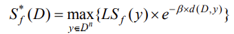

## 差分隐私定义：
1. 对于一个随机算法 M , Pm为算法 M 可以输出的所有值的集合。如果对于任意的一对相邻数据集 D 和 D’ , Pm 的任意子集 Sm , 算法 M 满足：  
`Pr[ M(D) ∈ Sm ] ⩽ exp(ε) ⋅ Pr[ M(D′) ∈ Sm ] + δ` 则称 M 满足 `(ε,δ)-DP` 这种形式的差分隐私是宽松的. 当 δ=0 时，称为 `ε-DP`   
也就是纯差分隐私定义. 其中 ε 称为隐私预算.   

2. 邻近集：只相差一条记录的一对数据集. 即 |D - D′| <= 1. 
3. 查询函数 `f:D→R`.  全体查询记作 F. 

4. 全局敏感度 ：`GSf(D) = Δf = max(D,D′) ∥f(D)−f(D′)∥1`.  `∥f(D)−f(D′)∥1` 是 f(D) 与 f(D‘) 之间的曼哈顿距离
全局敏感度反映了一个查询函数在一对相邻数据集上进行查询时变化的最大范围。它与数据集无关, 只由查询函数本身决定

5. 局部敏感度 ：`LSf(D) = Δf = max(D′) ∥f(D)−f(D′)∥1`.  `∥f(D)−f(D′)∥1` 是 f(D) 与 f(D‘) 之间的曼哈顿距离  
与全局敏感度不同, 局部敏感度是由查询函数和给定的数据集共同决定, 因为局部敏感度只是对于一个数据集做变化

局部敏感度和全局敏感度的关系可以表示为：`S(f) = max(D) {LSf(D)}`
容易看出，局部敏感度会与数据分布有很强的关联，但全局敏感度一般较大. 故在需要使用局部敏感度时，常采用局部敏感度的平滑上界.

6. 平滑上界  
给定一个 β > 0 , 对于一个函数 F:D --> R , 在查询函数 f 上, 如果它满足如下条件  
`∀D：F(D) >= LSf(D) ， ∀D,D’：F(D) <= exp(β) * LSf(D’)` 则称函数 F 是一个在查询函数 f 上的 β-平滑上界

7. 平滑敏感度
对于一个  β > 0 , 一个查询函数 f 的 β-平滑敏感度为：  

## 差分隐私性质
- 平行合成 
假设我们有一组隐私机制 `M = { M1， … ， Mm }` 如果每个 Mi 对整个数据集的互不相交子集提供 `ϵ-DP` 保证，则 M 将提供 `max {ϵ1，…，ϵm}-DP`  
这个性质说明了, 当有多个算法序列分别作用在一个数据集上多个不同子集上时, 最终的差分隐私预算等价于算法序列中所有算法预算的最大值

- 顺序合成 
假设在数据集上依次执行一组隐私机制 `M = { M1 ， . . . ， Mm }`，并且每个 Mi 提供 ϵ-DP 保证，则 M 将提供 `(m * ϵ)-DP`  
这个性质说明了, 当有一个算法序列同时作用在一个数据集上时, 最终的差分隐私预算等价于算 法序列中所有算法的预算的和

- 变换不变性  
给定任意一个算法 M1 满足 `ε-DP`, 对于任意算法 M2 ( M2 不一定是满足差分隐私的算法), 则有 M(•) = M2(M1(•) 满足  `ε-DP`  
这个性质说明了差分隐私对于后处理算法具有免疫性, 如果一个算法的结果满足 `ε-DP`, 那么在这个结果上进行的任何处理都不会对隐私保护有所影响。

- 中凸性  
给定 2 个算法 M1 和 M2 满足 `ε-DP`。对于任意的概率 p∈[0,1], 用符号 Mp 表示为一种机制, 它以 p 的概率使用 M1 算法, 以 1-p 的概率使  
用 M2 算法, 则 Mp 机制满足 `ε-DP`  
这个性质说明, 如果有 2 个不同的差分隐私算法, 都提供了足够的不确定性来保护隐私, 那么可以通过选择任意的算法来应用到数据上实现对数据的隐私保护，只要选择的算法和数据是独立的。

## 数值性查询的隐私保护机制 
### Laplace 机制
Laplace分布：这里只考虑均值为 0 的Laplace分布. 尺度参数为 b 的Laplace分布记为 Lap(b)，
其密度函数为：`p(x) = 1/2b * exp(−|x| / b)`

Laplace机制就是给查询结果添加服从Laplace分布的噪声，即：
 `Pr[ M(D) ∈ S ] ⩽ exp(ε) * Pr[ M(D′) ∈ S ] + δ`  `M(D) = f(D) + Y`  
`Y~Lap(0, Δf / ε)` 满足 `(ε,0)-DP` 

### 高斯机制
Laplace机制提供的是严格的 `(ε,0)-DP` ，而高斯机制则提供的是松弛的 `(ε,δ)-DP` 机制。  
高斯机制是拉普拉斯机制的替代方案，不同在于加的是高斯噪声而不是拉普拉斯噪声。

理论机制：
对于任意的 ` δ ∈ （0，1）, σ > sqrt(2 * Δf**2 * log(1.25/δ)) / ε`,有噪声 `Y~N(0,σ**2)` 满足 `(ε,δ)-DP`  
定义： `Pr[M(D) ∈ S] ⩽ exp(ε) ⋅ Pr[M(D′) ∈ S] + δ` 其中`M(D) = f(D) + Y `   

参数  
- 高斯分布的标准差 σ，这决定了噪声的尺度
- ε 表示隐私预算，和噪声成负相关
- δ 表示松弛项，比如设置为 10^(-5) ，就表示只能容忍 10^(-5) 的概率违反严格差分隐私

## 非数值性查询 
### 指数机制
指数机制整体的思想就是，当接收到一个查询之后，不是确定性的输出一个 Ri 结果，而是以一定的概率值返回结果，从而实现差分隐私。
而这个概率值则是由打分函数确定，得分高的输出概率高，得分低的输出概率低，当然分越高，表示这个数据越重要。  
打分函数：`u(D,Ri) ` D 数据集，`u(D,Ri)` 表示某一个输出结果 Ri 的得分   
u 的改变：`∆u = max(D,D′) |u(D,R) - u(D′,R)|`  
设计指数机制的出发点即为对于任意的 r，按照`exp(εu(x, r)/∆u)` 的概率选取最优解即可满足差分隐私要求：
`ln((exp(εu(D, r)/∆u))/(exp(εu(y, r)/∆u))) = ε[u(x, r) - u(y,r)]/∆u <= ε`  

因此得出了指数机制：设`随机化算法 M(x,u,R)`若以正比于`exp(εu(x, r)/ (2 * ∆u))` 的概率从输入中选择并输出r，则 算法M 是 ε-DP.
输入为`数据集 x`，μ为可用性函数`u(x,R)`，输出为一个实体对象 `r∈R`，`Δμ`为函数 `μ(x,R)` 的敏感度  

| 疾病   | 可用性, ∆u=1 | exp((ε * u(x, R))/(2∆u)) | ε=0 概率 | ε=0.1 概率 |
|:-----|:----------|:-------------------------|:-------|:---------|
| math | 50        | exp((ε * u(50,R)) / 2*1) | 0.333  | 0.628    | 
| AI   | 20        | exp((ε * u(20,R)) / 2*1) | 0.333  | 0.124    | 
| DP   | 30        | exp((ε * u(30,R)) / 2*1) | 0.333  | 0.231    | 

### 可用性评估
给数据加噪声必定会降低数据的可用性，对可用性的评估一般有以下几种：

1. 直接看噪声大小：噪声 ↓，可用性 ↑.
2. 对误差进行度量：单次查询误差为 ∥f(D)−fn(D)∥ （fn 表示加了噪音的 f）
3. (α,β)-可用性：当 F 满足
> Pr[maxf ∈ F| f(D) − fn(D)|⩽α]>1−β  
> 称 D 是 (α,β)-可用的.

